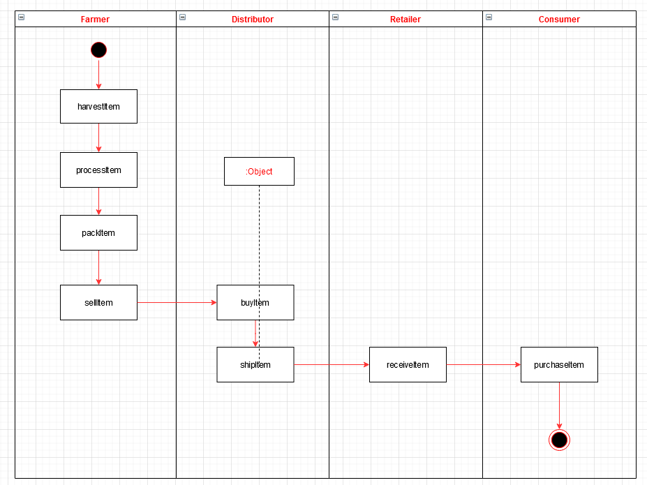
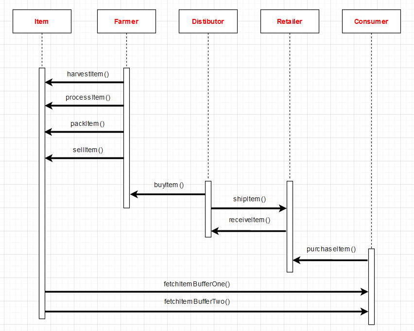
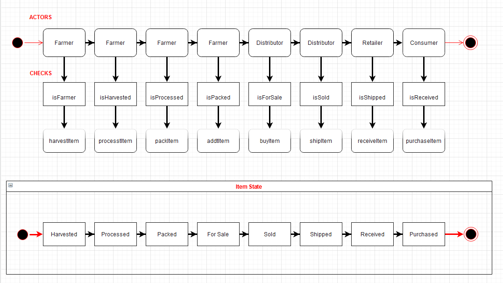
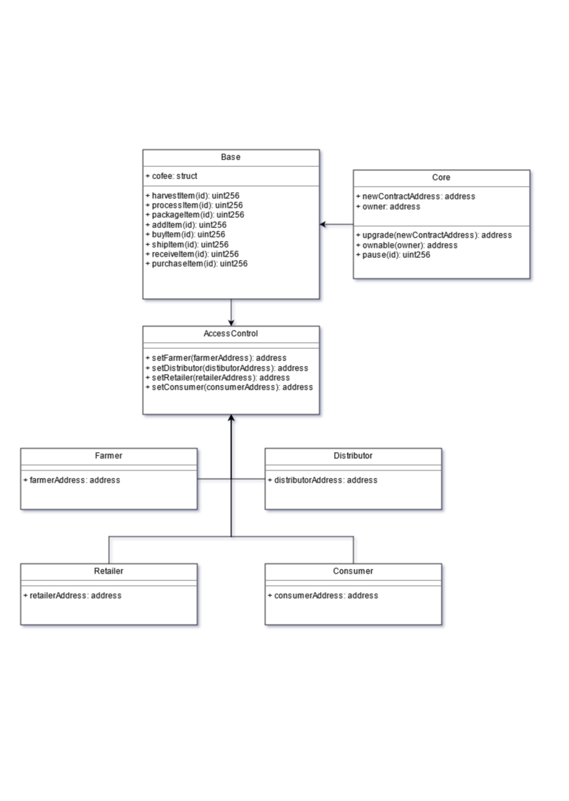

# Project 3: Supply Chain & Data Auditing

This repository contains an Ethereum DApp that demonstrates a Supply Chain flow between a Seller and Buyer. The user story is similar to any commonly used supply chain process. A Seller can add items to the inventory system stored in the blockchain. A Buyer can purchase such items from the inventory system. Additionally a Seller can mark an item as Shipped, and similarly a Buyer can mark an item as Received.


### Versions Used
Ganache CLI v6.12.2 (ganache-core: 2.13.2)

Truffle v5.4.6 (core: 5.4.6)

Solidity v0.5.16 (solc-js)

Node v15.14.0

Web3.js v1.5.1

<br>

### Contract on Rinkeby Network: 
0x79ad8de67fbf1699f16b6aef06d57fea8c68f7d0
### Transaction on Rinkeby Network: 
0x0d970056e8321919415141c47d03789317fe97608e2ddb97d7843d6f363f091d
### https://rinkeby.etherscan.io/address/0x79ad8de67fbf1699f16b6aef06d57fea8c68f7d0


<br>

## Project Write-up
### UML Diagrams

#### Activity Diagram



#### Sequence Diagram



#### State Diagram



#### Classes Diagram



<br>


## Getting Started
### Prerequisites

```

### Install

nvm install 15.14.0
    -Setup nvm for different node versions
        >https://www.sitepoint.com/quick-tip-multiple-versions-node-nvm/

npm install -g truffle
truffle version
    Truffle v5.4.6 (core: 5.4.6)
    Solidity v0.5.16 (solc-js)
    Node v15.14.0
    Web3.js v1.5.1

npm install -g ganache-cli
ganache-cli --version
    Ganache CLI v6.12.2 (ganache-core: 2.13.2)

npm install --save  truffle-hdwallet-provider@1.0.17
npm install web3    
```
<br>

### Project Setup

```

git clone https://github.com/Ojhojojo/udacity-project3-supply-chain.git

    -Change directory to ```project``` folder and install all npm packages 

cd project
npm install

```

Launch Ganache:

```
ganache-cli -m "spirit supply whale amount human item harsh scare congress discover talent hamster"
```

Your terminal should look something like this:


In a separate terminal window, Compile smart contracts:

```
truffle compile
```

Your terminal should look something like this:


This will create the smart contract artifacts in folder ```build\contracts```.

Migrate smart contracts to the locally running blockchain, ganache-cli:

```
truffle migrate
```

Your terminal should look something like this:


Test smart contracts:

```
truffle test
```
All 10 tests should pass.


In a separate terminal window, launch the DApp:
```
npm run dev
```
The DApp User Interface when running should look like the images below on:
 http://localhost:3000/


<br>

### Project Deployment

Update the  `const infuraKey` and `const mnemonic` on `truffle-config.js` file
then input in a terminal:

```
truffle migrate --reset --network rinkeby
```